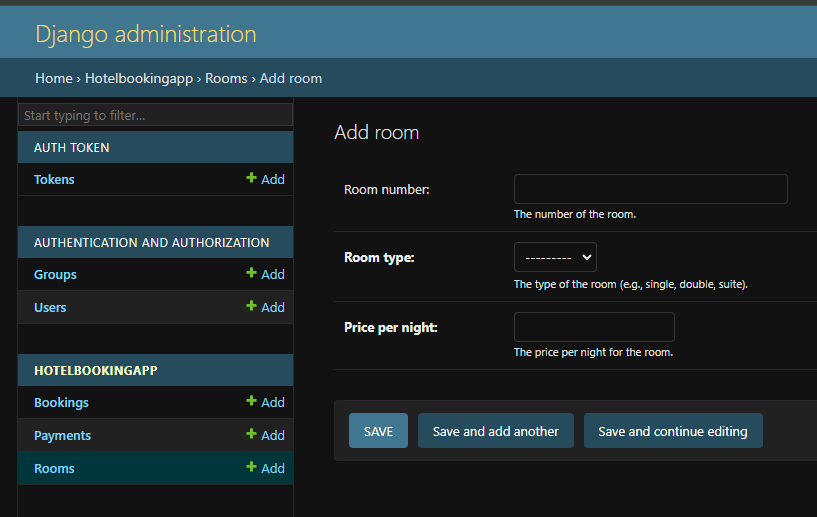

# Hotel Reservation System Backend API.

This is a web api that allows users to book reseravations, check room availability, and also cancel a reservation.

# Creating a Room for booking

Create a room for booking only in the admin panel. Check the image below for how the admin panel looks like. Follow these steps to create a room:

1. Navigate to the url `http://localhost:8000/admin/hotelBookingApp/room/add/`.
2. Log in with superuser credentials. (If you have no credentials then create one with the steps provided below in this document.)
3. Click the `+Add` icon in the left side of the admin panel next to `Rooms`.
4. Leave `Room number` blank as it will be automatically assigned upon creation.
5. Select `Room type` and enter the `Price per night` for the room, then save.
6. Proceed to now test the application via postman or whichever means you prefer.

See image below. Steps for creating a superuser are provided after this image.

# Admin Panel image



# Steps to Create a Superuser in Django

Follow these steps to create a superuser in your Django project:

1. **Activate the Virtual Environment** (if applicable):

   - If your project uses a virtual environment, activate it first.
   - Example:
     ```bash
     source venv/bin/activate  # On Linux/Mac
     venv\Scripts\activate     # On Windows
     ```

2. **Run the Django Management Command**:

   - Navigate to your project directory (where `manage.py` is located).
   - Run the following command:
     ```bash
     python3 manage.py createsuperuser
     ```

3. **Provide Superuser Details**:

   - You will be prompted to enter the following details:
     - **Username**: Enter a username for the superuser.
     - **Email Address**: Enter an email address (optional, depending on your configuration).
     - **Password**: Enter a secure password and confirm it.

4. **Verify Superuser Creation**:

   - If the details are valid, the superuser will be created successfully.
   - Example output:
     ```
     Superuser created successfully.
     ```

5. **Log in to the Admin Panel**:
   - Start the development server:
     ```bash
     python manage.py runserver
     ```
   - Open your browser and go to `http://127.0.0.1:8000/admin/`.
   - Log in using the superuser credentials you just created.

---

That's it! You now have a superuser account to manage your Django project.

## Documentation

- Documentation: [docs](https://documenter.getpostman.com/view/10693271/2sAYX3rP6u)

### Prerequisites and Installing

You need to install the following software/technologies to have the app running on your local machine for development and testing purposes. Instructions on how to install will also be provided next to the software.

| Software                      | Installation Instructions/Terminal Commands      |
| ----------------------------- | ------------------------------------------------ |
| Python3.8                     | 1. sudo apt-get update                           |
|                               | 2. sudo apt-get install python3.8                |
| Virtual Environment           | 1. Python3 -m venv venv                          |
|                               | 2. Activate by running: source venv/bin/activate |
| Pip                           | pip install --upgrade pip                        |
| Django 4.2.18                 | pip install Django                               |
| djangorestframework           | pip install djangorestframework                  |
| djangorestframework.authtoken | pip install djangorestframework.authtoken        |
| Pyscopg2-binary               | pip install psycopg2-binary                      |

## Built With

- [Django] - 4.2 (https://docs.djangoproject.com/en/4.2/)

## Contributing

Please read [CONTRIBUTING.md](https://gist.github.com/PurpleBooth/b24679402957c63ec426) for details on our code of conduct, and the process for submitting pull requests to us.

## Authors

- **Wendy Munyasi**

## License

This project is licensed under the Apache License.

## Api Link and description

**Postman** can be used to access the api routes as the token identifier is provided directly.

## Project-Setup Instructions.

1.Open your github account and search for github username: **wendymunyasi**

1. git clone using the following links.

   link: https://github.com/wendymunyasi/hotel-booking-api.git

2. For Django app, set the database to your own url then run `python3 manage.py makemigrations` and `python3 manage.py migrate`.
3. Run the command `python3 manage.py runserver`.
4. Click the local host link on your terminal and navigate to the api root.

## NOTE

Almost every action is documented on the console, from creating a booking or deleting a booking. For curiouser and curiouser, open your console and view what messages display when you perform an action.

## Collaborate

To colloborate, reach me through my email address wendymunyasi@gmail.com
